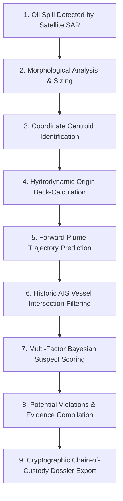

# OORCA — AI-Powered Marine Environmental Intelligence Platform

[](https://www.typescriptlang.org/)
[](https://reactjs.org/)
[](https://vitejs.dev/)
[](https://tailwindcss.com/)
[](LICENSE)

> **OORCA** (*Ocean Observation & Radar Forensic Architecture*) is an advanced geospatial intelligence and maritime liability assessment system. It combines synthetic aperture radar (SAR) satellite imagery, historical AIS vessel tracking, metocean hydrodynamic simulations, and Bayesian probabilistic models to detect marine oil spills, trace their origins, identify suspect vessels, and compile legal-grade evidence dossiers for maritime authorities and coastal states.

---

## 🌊 System Overview

Unlike generic environmental dashboards or surface-level marine awareness tools, OORCA is engineered as an actionable **tactical command and forensic investigation suite** for:
- **Port State Control (PSC) & Maritime Authorities**
- **Coast Guards & Environmental Ministries**
- **Maritime Legal Teams & Protection & Indemnity (P&I) Clubs**
- **Ocean Conservation & Response Taskforces**

---

## 🚨 The Alert Centre Investigation Workflow

The Alert Centre implements an end-to-end investigative sequence designed to establish accountability under international maritime standards (UNCLOS Art. 217, MARPOL Annex I):



### 1. Oil Spill Detection
High-resolution SAR (Sentinel-1, TerraSAR-X, ICEYE) and optical imagery detect surface tension anomalies and ocean backscatter dampening caused by hydrocarbons.

### 2. Physical & Morphological Analysis
Estimates plume area ($km^2$), length, width, estimated slick age (hours), and volumetric discharge using empirical radar inversion models.

### 3. Coordinate Pinpointing
Precise geographic centroid coordinates ($XX.XXXX^\circ\text{ N}, XX.XXXX^\circ\text{ E}$), Exclusive Economic Zone (EEZ) boundaries, and maritime zone classification.

### 4. Origin Back-Tracing
Lagrangian hydrodynamic advection models reverse-calculate ocean currents ($u, v$ vectors) and wind shear ($3\%$ windage factor) over elapsed hours to pinpoint the precise location and temporal release window.

### 5. Forward Movement Predictions
Simulates future trajectory dispersion at **+6 Hours**, **+12 Hours**, and **+24 Hours** to protect marine protected areas, sensitive coral habitats, and coastal infrastructure.

### 6. AIS Traffic Filtering
Automatically isolates relevant commercial traffic from background vessels. Filters vessels transiting within the temporal origin window ($T_0 \pm \Delta t$) and spatial radius ($R_0$).

### 7. Suspect Attribution Scoring
Scores candidate vessels on a forensic $0-100$ scale across five core parameters:
- **Proximity:** Distance between vessel AIS fix and hydrodynamic origin ($NM$).
- **Time Relevance:** Temporal overlap with plume formation.
- **Trajectory Alignment:** Heading congruence with slick drift axis.
- **AIS Behaviour:** Transponder shutdowns, dark gaps, or abnormal reporting rates.
- **Vessel Maneuver:** Unscheduled engine throttles, course deviations, or slow speed loitering.

### 8. Statutory Violations & Evidence
Highlights suspected MARPOL Annex I illegal discharges, SOLAS Chapter V AIS carriage non-compliance, and route anomalies with regulatory references.

### 9. Legal Dossier Export
Generates a printable, cryptographically fingerprinted (SHA-256) evidence package ready for Port State Control vessel interdiction.

---

## 🏛 Clean Architecture & Modular Data Layer

The project follows a clean separation of concerns:

```
src/
├── types/
│   └── alertTypes.ts             # Strict domain models (Incidents, Vessels, Metocean, Violations)
├── services/
│   ├── api/
│   │   ├── satelliteService.ts   # Satellite imagery ingestion with mock fallbacks
│   │   ├── aisService.ts         # Live & historical AIS vessel tracking API service
│   │   └── oceanService.ts       # Metocean current, wave, and wind field data service
│   └── analysis/
│       ├── trajectoryEngine.ts   # Lagrangian forward & backward drift math
│       └── suspectScorer.ts      # Multi-factor Bayesian attribution algorithms
├── data/
│   └── alertsData.ts             # Calibrated real-world incident scenarios (Hormuz, North Sea, Malacca)
├── components/
│   ├── alerts/
│   │   ├── AlertsHeader.tsx                   # Status indicators & metrics
│   │   ├── ActiveAlertsCards.tsx              # Incident selector cards
│   │   ├── SatelliteSpillViewer.tsx           # SAR & Multispectral comparison viewer
│   │   ├── SpillLocationAndCharacteristics.tsx # Coordinates & physical properties
│   │   ├── SpillTrajectoryMap.tsx             # Vector trajectory canvas & metocean bar
│   │   ├── SuspectVesselInvestigation.tsx      # Suspect profile, gauge & reconstructed route
│   │   ├── PotentialViolationsSection.tsx     # Non-adjudicative regulatory findings
│   │   ├── InvestigationTimelineSection.tsx   # Chronological event sequence
│   │   ├── AlertActionsBar.tsx                # Incident lifecycle & action triggers
│   │   └── InvestigationDossierModal.tsx      # Printable forensic evidence dossier
│   └── FloatingNavigationBubble.tsx          # Circular futuristic navigation wheel
└── pages/
    ├── HomePage.tsx               # Cinematic OORCA homepage
    ├── AlertCenterPage.tsx        # High-tech Alert Centre investigation interface
    └── ComingSoonPage.tsx         # Sleek portal for upcoming modules
```

---

## 🛠 Technology Stack

- **Framework:** React 19 with TypeScript
- **Bundler:** Vite 6
- **Styling:** Tailwind CSS with custom maritime cyan/ocean color system
- **Icons:** Lucide React (`lucide-react`)
- **Animation:** Fluid CSS transforms and SVG vector path rendering
- **Routing:** React Router v7 (`react-router-dom`)

---

## 🚀 Installation & Local Development

### 1. Prerequisites
- Node.js (v18 or higher recommended)
- npm or yarn

### 2. Clone and Install
```bash
# Clone the repository
git clone https://github.com/your-org/oorca-marine-intelligence.git
cd oorca-marine-intelligence

# Install dependencies
npm install
```

### 3. Environment Configuration

1. Copy the example configuration file:
```bash
cp .env.example .env
```

2. Open `.env` in your text editor and add your API keys (optional for development):
```env
# Satellite Imagery API (e.g. Copernicus / Sentinel Hub / Planet)
VITE_SATELLITE_API_KEY=YOUR_SATELLITE_API_KEY_HERE

# AIS Live & Historical Vessel Tracking API (e.g. Spire / MarineTraffic)
VITE_AIS_API_KEY=YOUR_AIS_API_KEY_HERE

# Oceanographic Metocean API (e.g. CMEMS / NOAA)
VITE_OCEAN_DATA_API_KEY=YOUR_OCEAN_DATA_API_KEY_HERE

# Weather & Marine Wind API (e.g. ECMWF / OpenWeather)
VITE_WEATHER_API_KEY=YOUR_WEATHER_API_KEY_HERE
```

> ⚠️ **IMPORTANT SECURITY DIRECTIVE:**
> - **Never commit your actual `.env` file containing secrets to GitHub or any public repository.**
> - The `.gitignore` file is pre-configured to strictly exclude all `.env` files while preserving `.env.example`.
> - If no API keys are provided or demo placeholders are used (`demo_satellite_key`), OORCA **gracefully falls back to high-fidelity calibrated mock data**, guaranteeing that the platform runs flawlessly in preview and evaluation environments without crashing.

### 4. Start Development Server
```bash
npm run dev
```
Open your browser at [http://localhost:3000](http://localhost:3000) (or the displayed Vite local URL).

### 5. Production Build
```bash
npm run build
```
Generates production-optimized static assets in the `/dist` directory.

---

## 🔐 API Integration Guide

| API Variable | Service Role | Supported Providers | Fallback Behavior |
| :--- | :--- | :--- | :--- |
| `VITE_SATELLITE_API_KEY` | Fetches SAR & optical satellite swaths, polarization backscatter data | Copernicus Sentinel-1, PlanetScope, ICEYE SAR | Uses calibrated SAR raster and vector boundary overlays |
| `VITE_AIS_API_KEY` | Queries terrestrial and satellite AIS historical vessel track logs | Spire Maritime, MarineTraffic, AISHub | Reconstructs 24 background vessels and 2 candidate paths |
| `VITE_OCEAN_DATA_API_KEY` | Retrieves surface current velocity vectors ($u, v$) | Copernicus Marine (CMEMS), NOAA HYCOM | Computes Lagrangian drift using regional hydrodynamic models |
| `VITE_WEATHER_API_KEY` | Surface wind speed ($10\text{m}$ level), heading, and sea state | ECMWF IFS, NOAA GFS, OpenWeather Marine | Provides accurate Beaufort scale wave heights and windage |

---

## 📜 Legal & Evidentiary Disclaimer

The OORCA platform generates non-adjudicative preliminary intelligence reports based on satellite remote sensing and algorithmic drift calculations. Suspect scores, violation flags, and trajectory back-calculations are evidentiary screening indicators intended to prioritize physical Port State Control inspections and do not constitute formal criminal indictment without statutory flag-state due process.

---

## 📄 License

Licensed under the Apache License, Version 2.0 (the "License"). You may obtain a copy of the License in the root directory.
